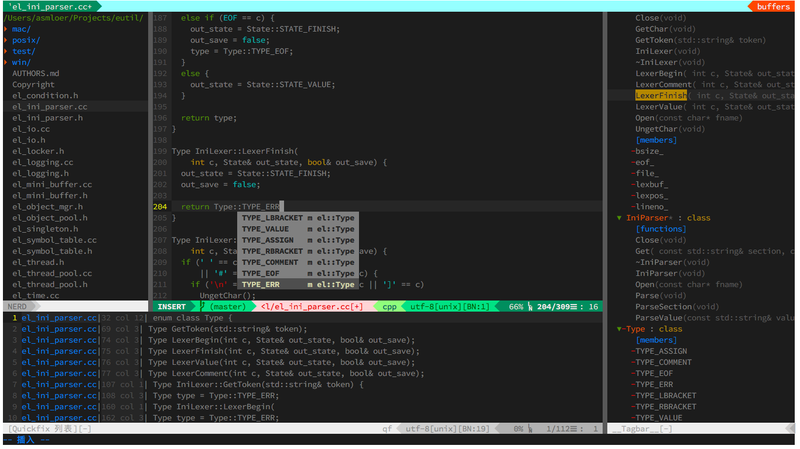

# **eNeovim: Configure for Neovim**
***
**Configure files for [Neovim](https://github.com/neovim/neovim), built for Linux and macOS.**

## **Usage**
  * `,d` brings up [NERDTree](https://github.com/scrooloose/nerdtree), a sidebar buffer for navigating and manipulating files, open a fresh NERD tree
  * `,j` same as `,d`, jump to the current file in NERD tree
  * `,a` starts project search with [ag.vim](https://github.com/rking/ag.vim) using [the silver searcher](https://github.com/ggreer/the_silver_searcher)(like ack, but faster)
  * `,=` begins aligning lines on a string, usually used as `,l=` to align assignments
  * `,]` brings up [tagbar](https://github.com/majutsushi/tagbar), a sidebar buffer for displaying tags
  * `,f` brings up [LeaderF](https://github.com/Yggdroot/LeaderF), quickly locate files, buffers, mrus, ... in large project, launch LeaderF to search files
  * `,p` same as `,f`
  * `,b` same as `,f`, launch LeaderF to search buffers
  * `,i` brings up [indentLine](https://github.com/Yggdroot/indentLine), display the indention levels with thin vertical lines
  * `,,` display the whitespace(tab or space)
  * `,ev` editing your `init.vim($MYVIMRC)`
  * `,sv` reloading your `init.vim($MYVIMRC)`
  * `,gs` brings up [vim-fugitive](https://github.com/tpope/vim-fugitive), used as `:Gstatus`
  * `,gc` used as `:Gcommit`

## **Neovim for Linux**
### **Build Neovim**
Before upgrading to a new version, **ALWAYS** check the [Following HEAD](https://github.com/neovim/neovim/wiki/Following-HEAD) page.
  * General requirements:
    - A recent version of Clang or GCC version 4.3 and above
    - CMake version 2.8.7 and above, build with TLS/SSL support
```sh
    $ sudo pip install neovim
    $ sudo apt-get install libtool libtool-bin autoconf automake cmake g++ pkg-config unzip
```
  * Clone **[Neovim](https://github.com/neovim/neovim)**
```sh
    $ git clone https://github.com/neovim/neovim.git
```
  * Build Neovim by running `make`
```sh
    $ rm -rf .deps build
    $ cd neovim
    $ make CMAKE_BUILD_TYPE=Release
```
### **Install Neovim**
Once you've built Neovim, install it with the following commands:
```sh
    $ sudo make install
```
### **Uninstall Neovim**
To uninstall Neovim installed with `sudo make install`:
```sh
    $ sudo rm /usr/local/bin/nvim
    $ sudo rm -r /usr/local/share/nvim/
```

## **Neovim for macOS**
Before upgrading to a new version, **ALWAYS** check the [Following HEAD](https://github.com/neovim/neovim/wiki/Following-HEAD) page.
### **Build Neovim**
  * General requirements:
    - A recent version of Clang or GCC version 4.3 and above
    - CMake version 2.8.7 and above, build with TLS/SSL support
    - Install [Xcode](https://developer.apple.com/) and [Homebrew](http://brew.sh/) or [MacPorts](https://www.macports.org/)
    - Install Xcode commandline tools `xcode-select --install`
  * Install other dependencies:
```zsh
    $ sudo pip install neovim
    $ sudo brew install libtool automake cmake pkg-config gettext
```
  * After this you may need to run make distclean && make before the tests will run
```zsh
    $ make distclean
    $ make
```
  * **If you see wget certificate errors**(for OSX before version 10.10/Yosemite):
```zsh
    $ sudo brew install curl-ca-bundle
    $ echo CA_CERTIFICATE=$(brew --prefix curl-ca-bundle)/share/ca-bundle.crt >> ~/.wgetrc
```
  * Clone **[Neovim](https://github.com/neovim/neovim)**
```zsh
    $ git clone https://github.com/neovim/neovim.git
```
  * Build Neovim by running `make`
```zsh
    $ cd neovim
    $ make CMAKE_BUILD_TYPE=Release
```
### **Install Neovim**
Once you've built Neovim, install it with the following commands:
```zsh
    $ sudo make install
```
### **Uninstall Neovim**
To uninstall Neovim installed with `make install`:
```zsh
    $ sudo rm /usr/local/bin/nvim
    $ sudo rm -r /usr/local/share/nvim/
```

## **Install eNeovim for Linux**
  * Clone and install **[eNeovim](https://github.com/ASMlover/eNeovim)**
```sh
    $ git clone https://github.com/ASMlover/eNeovim.git
    $ cd eNeovim
    $ ./install.sh install
```
  * Clone and install **[ag](https://github.com/ggreer/the_silver_searcher)**
```sh
    $ git clone https://github.com/ggreer/the_silver_searcher.git ag
    $ cd ag
    $ ./build.sh
    $ sudo make install
```
  * Install powerline-fonts
```sh
    $ git clone https://github.com/powerline/fonts.git
    $ cd fonts
    $ ./install.sh
    $ sudo cp -R ~/.local/share/fonts /usr/share/fonts
    $ sudo fc-cache -f -v
```
  * Build **[YCM](https://github.com/Valloric/YouCompleteMe)**

    If you enabled the plugin `ycm(let g:plugin_ycm_enabled=1)`, you need to build it.
```sh
    $ cd ~/.config/nvim/plugged/YouCompleteMe
    $ python install.py --clang-completer
```

## **Install eNeovim for macOS**
  * Clone and install **[eNeovim](https://github.com/ASMlover/eNeovim)**
```zsh
    $ git clone https://github.com/ASMlover/eNeovim.git
    $ cd eNeovim
    $ ./install.sh install
```
  * Clone and install **[ag](https://github.com/ggreer/the_silver_searcher)**
```zsh
    $ git clone https://github.com/ggreer/the_silver_searcher.git ag
    $ cd ag
    $ ./build.sh
    $ sudo make install
```
  * Install powerline-fonts
```zsh
    $ git clone https://github.com/powerline/fonts.git
    $ cd fonts
    $ ./install.sh
```
  * Build **[YCM](https://github.com/Valloric/YouCompleteMe)**

    If you enabled the plugin `ycm(let g:plugin_ycm_enabled=1)`, you need to build it.
```zsh
    $ cd ~/.config/nvim/plugged/YouCompleteMe
    $ python install.py --clang-completer
```

**[Neovim](https://github.com/neovim/neovim)** with **[eNeovim](https://github.com/ASMlover/eNeovim)** screen shot

